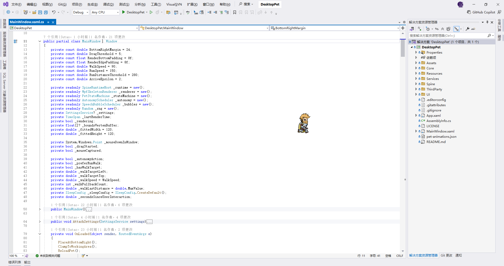
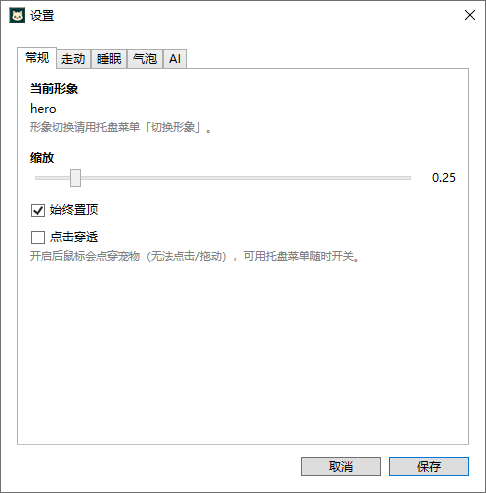

# DesktopPet

基于 **WPF + Spine** 的 Windows 桌面宠物。无边框透明置顶窗口，播放 Spine 骨骼动画，支持拖拽、点击互动、自主走动与睡眠。

> **现状说明：**主流程基本能跑，但仍有瑕疵与未打磨之处，自行AI解决，请勿当作成品软件预期。
## 截图

桌面宠物：



设置界面：



## 技术栈

- .NET 9 / WPF
- Spine Runtime（C#，版本需与导出工具一致）
- 渲染：自研 `WpfSkeletonRenderer`（WriteableBitmap）
- 系统托盘：NotifyIcon

## 功能规划

| 阶段 | 内容 | 状态 |
|------|------|------|
| P0 | 透明置顶窗、拖拽、托盘退出 | 已完成 |
| P1 | 加载 Spine、播放 idle | 已完成 |
| P2 | 状态机（点击 / 拖拽 / 睡眠） | 已完成 |
| P2/P3 | 自主走动（walkArea + 停顿 / 随机动作） | 已完成 |
| P3 | 多皮肤、缩放、点击穿透、设置页 | 已完成 |

不做开机自启。

## 环境要求

- Windows 10/11
- [Visual Studio 2022](https://visualstudio.microsoft.com/)（建议安装「.NET 桌面开发」工作负载，用于打开/调试本项目）
- [.NET 9 SDK](https://dotnet.microsoft.com/download/dotnet/9.0)（也可随 VS2022 安装）
- Spine 导出资源（与 Runtime 主版本匹配，例如 4.3.x）

## 快速开始

```bash
git clone <repo-url>
cd DesktopPet
dotnet restore
dotnet run --project DesktopPet.csproj
```

也可在 Visual Studio 2022 中打开 `DesktopPet.sln`，还原 NuGet 后按 F5 运行。

托盘菜单可切换形象、开关点击穿透、打开设置。用户设置保存在 `%AppData%/DesktopPet/settings.json`。

## 资源放置

每个宠物一个目录，**运行时只使用 `export/`**：

```text
Assets/Pets/{petName}/
  ├── export/                 # 会复制到编译输出（程序加载）
  │   ├── *.atlas
  │   ├── *.png
  │   └── *-pro.skel / *.json
  ├── images/                 # 编辑器用，不输出
  └── *.spine                 # 编辑器用，不输出
```

在配置中指定宠物名（默认 `default`）。**Spine 编辑器导出版本必须与引用的 spine-csharp Runtime 版本一致。**

### 动作映射配置

程序根目录（输出目录）下的 `pet-animations.json` 控制 idle / 点击 / 拖拽 / 走动 / 睡眠等候选动画，**增改素材只需改此文件**：

```json
{
  "includeAllNonIdleOnClick": true,
  "defaults": {
    "idle": ["idle"],
    "click": ["jump"],
    "drag": [],
    "walk": ["walk", "run"],
    "sleep": ["sleep", "death", "idle"]
  },
  "pets": [
    { "match": "spineboy", "click": ["jump", "shoot", "portal"], "walk": ["walk", "run"] }
  ]
}
```

- `defaults`：所有形象的通用候选（按顺序匹配骨架里真实存在的动画名）
- `pets[].match`：与骨骼文件名或宠物文件夹名做包含匹配（忽略大小写）
- `includeAllNonIdleOnClick`：为 true 时，点击还会轮换该骨架里其余非 idle 动画
- 修改后重启程序生效（也可后续做成热加载）

## 项目结构

```text
DesktopPet/
├── Assets/Pets/default/          # Spine 资源（skel/json + atlas + png）
├── Core/                         # PetState / PetStateMachine / PetConfig / Autonomy*
├── Spine/                        # SpineRuntimeHost / WpfSkeletonRenderer / AnimationController
├── UI/                           # TrayIconService、SettingsWindow
├── Services/                     # SettingsService / ClickThroughService 等
├── Resources/                    # 其它静态资源
└── ThirdParty/SpineCSharp/       # 官方 spine-csharp 源码（方案 B，拷入主项目）
```

### 接入 spine-csharp（方案 B）

将官方 [spine-csharp](https://github.com/EsotericSoftware/spine-runtimes/tree/4.3/spine-csharp) 的 `src` 目录下 `.cs` 文件拷贝到：

```text
ThirdParty/SpineCSharp/
```

保持原有子目录结构（例如 `Attachments/`）。主项目 SDK 会自动编译这些源码，无需单独 `ProjectReference`。

WPF 工程已在 `.csproj` 中排除 `ColorMono.cs`（MonoGame/XNA）和 `ColorUnity.cs`（Unity），仅使用 `ColorOther.cs`。

升级 Runtime 时：用对应分支的新 `src` 覆盖 `ThirdParty/SpineCSharp/`，并确认导出资源版本一致。

## 架构说明

- **MainWindow**：透明无边框主窗，处理拖拽、点击、自主走动
- **PetStateMachine**：Idle / Walk / Sleep / Clicked 等状态切换
- **AutonomyScheduler**：安静节奏（停 → 走 → 停 → 动作）
- **SpineRuntimeHost**：Skeleton 加载与每帧 Update
- **WpfSkeletonRenderer**：将 Spine 网格绘制到 WPF 可显示表面

## 开发约定

- Spine Runtime 与资源导出版本保持一致，升级时同步两边
- 渲染与 UI 解耦：Window 只发事件，不直接操作 Skeleton 内部数据
- 用户设置写到 `%AppData%/DesktopPet/settings.json`
- `ThirdParty/SpineCSharp` 为官方源码，尽量少改；业务封装写在 `Spine/`

## 已知限制

- WPF 无官方 Spine 控件，需自实现渲染桥接
- 仅支持 Windows（WPF）
- 开启点击穿透后无法直接点宠物，需用托盘开关关闭

## License

本项目**自有代码与文档**以 [MIT License](LICENSE) 开源（Copyright © 2026 Sutao）。

MIT 仅覆盖本仓库原创部分，例如 `Core/`、`UI/`、`Services/`、`Spine/`、`App.*`、`MainWindow.*` 及工程配置等，**不包含**下列第三方内容：

| 成分 | 许可 |
|------|------|
| [`ThirdParty/SpineCSharp`](ThirdParty/SpineCSharp) | [Spine Runtimes License](https://esotericsoftware.com/spine-runtimes-license)（关联 [Spine Editor License](https://esotericsoftware.com/spine-editor-license)）。再分发须保留版权与许可声明；将 Runtime 集成到产品时，终端用户通常需自备 Spine Editor 授权。 |
| [`Assets/Pets`](Assets/Pets) 示例形象 | 来自 Esoteric Software 官方 Spine examples。多数示例（如 default / alien / stretchyman）图片可随各目录 `license.txt` 再分发，**禁止任何商业用途**；**Hero**（© XDTech）仅供演示，**不得再分发或作为衍生作品基础**。 |

使用、分发或修改本仓库时，请同时遵守 MIT 与上述第三方条款。若用于商业产品，请更换自有 Spine 素材，并自行确认 Spine Runtime 授权是否满足你的场景。
